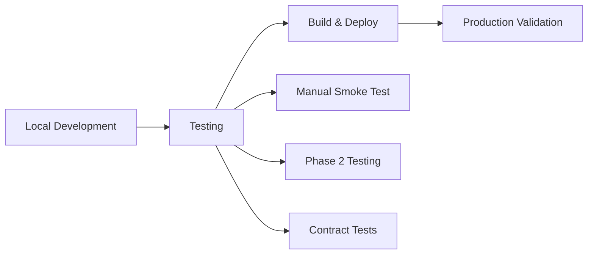

# Trust Game Documentation Hub

Welcome to the comprehensive documentation for the Trust Game application. This hub provides organized access to all technical documentation, guides, and reference materials.

## Index

- [README](README.md): Documentation hub and navigation.
- [API Reference](API_REFERENCE.md): Endpoints, request/response shapes, env vars.
- [Troubleshooting](TROUBLESHOOTING.md): Common issues and practical fixes.
- [Data Export](DATA_EXPORT.md): CSV schema and export workflow.
- [Integrity Verification](INTEGRITY.md): On-chain verification and proofs.

## Glossary

- UNIT: Minimum step size in µAlgos (e.g., 100000 = 0.1 ALGO).
- m: Multiplier applied to s (integer).
- s: Amount invested by S1 (Phase 1).
- t: Total available to S2; t = m × s.
- E1: Investor endowment (multiple of UNIT).
- E2: Trustee endowment (multiple of UNIT).
- r: Amount returned by S2 (Phase 2).
- Phases 0–3: 0 Registration; 1 Invest; 2 Return; 3 Done.

## 🚀 Quick Start

**New to the project?** Start here:

1. **[Main README](../README.md)** - Project overview and installation
2. **[Game Rules](../frontend/docs/trust-game-design.md)** - Understanding the Trust Game
3. **[API Reference](API_REFERENCE.md)** - Complete API documentation
4. **[Troubleshooting](TROUBLESHOOTING.md)** - Common issues and solutions

## 📚 Documentation Structure

### Core Documentation
| Document | Description | Audience |
|----------|-------------|----------|
| **[Main README](../README.md)** | Project overview, installation, architecture | Everyone |
| **[CHANGELOG](../CHANGELOG.md)** | Version history and completed features | Developers, Users |
| **[Game Rules](../frontend/docs/trust-game-design.md)** | Complete game specification and design | Researchers, Developers |
| **[Game Variants](../frontend/docs/trust-game-variants.md)** | Future enhancements and alternatives | Researchers, Product |

### Technical Reference
| Document | Description | Audience |
|----------|-------------|----------|
| **[API Reference](API_REFERENCE.md)** | Complete serverless API documentation | Developers |
| **[Troubleshooting](TROUBLESHOOTING.md)** | Common issues and debugging guide | Developers, Users |
| **[Data Export](DATA_EXPORT.md)** | CSV export formats and integrity | Researchers, Analysts |
| **[Integrity Verification](INTEGRITY.md)** | On-chain data verification methods | Researchers, Auditors |

### Testing & Quality Assurance
| Document | Description | Audience |
|----------|-------------|----------|
| **[Manual Smoke Test](../tests/manual/SMOKE.md)** | Complete end-to-end testing procedure | QA, Developers |
| **[Phase 2 Testing](../tests/PHASE_2_TESTING.md)** | Detailed Phase 2 validation guide | QA, Testers |
| **[Contract Tests](../contracts/)** | PyTest automated contract testing | Developers |

## 🎯 Documentation by Role

### 📊 For Researchers
**Goal: Run behavioral economics experiments**

1. **Start here**: [Game Rules](../frontend/docs/trust-game-design.md)
2. **Setup**: [Main README - Quick Start](../README.md#quick-start)
3. **Testing**: [Manual Smoke Test](../tests/manual/SMOKE.md)
4. **Data**: [Data Export](DATA_EXPORT.md) and [Integrity Verification](INTEGRITY.md)
5. **Variations**: [Game Variants](../frontend/docs/trust-game-variants.md)

### 👨‍💻 For Developers
**Goal: Contribute to or extend the application**

1. **Architecture**: [Main README - Architecture](../README.md#architecture)
2. **Setup**: [Main README - Local Development](../README.md#local-development)
3. **API**: [API Reference](API_REFERENCE.md)
4. **Testing**: [All testing documentation](#testing--quality-assurance)
5. **Debugging**: [Troubleshooting](TROUBLESHOOTING.md)

### 🔧 For DevOps/Admin
**Goal: Deploy and maintain the application**

1. **Deployment**: [Main README - Production Deployment](../README.md#production-deployment)
2. **Configuration**: [API Reference - Environment Variables](API_REFERENCE.md#environment-variables)
3. **Monitoring**: [Troubleshooting - Network Issues](TROUBLESHOOTING.md#network-and-api-issues)
4. **Security**: [Main README - Security](../README.md#security)

### 🧪 For QA Testers
**Goal: Validate application functionality**

1. **Manual Testing**: [Manual Smoke Test](../tests/manual/SMOKE.md)
2. **Phase Testing**: [Phase 2 Testing](../tests/PHASE_2_TESTING.md)
3. **Issue Reporting**: [Troubleshooting - Getting Help](TROUBLESHOOTING.md#getting-help)

## 🔄 Game Flow Quick Reference

```text
Phase 0: Registration
├─ S1 and S2 connect wallets
├─ Both opt into smart contract  
└─ Admin can verify registration

Phase 1: Investment Decision
├─ S1 decides investment amount (s)
├─ Smart contract refunds (E1 - s) to S1
├─ Investment multiplied: t = m × s
└─ Automatic transition to Phase 2

Phase 2: Return Decision  
├─ S2 sees multiplied amount (t)
├─ S2 decides return amount (r)
├─ Payouts: r → S1, (t - r + E2) → S2
└─ Automatic transition to Phase 3

Phase 3: Completion
├─ Game data available for export
├─ Admin can sweep remaining funds
└─ Smart contract can be deleted
```

## 🛠️ Key Technologies

- **Blockchain**: Algorand TestNet with TEAL smart contracts
- **Frontend**: React 19 + TypeScript + Vite
- **Wallet**: Pera Wallet integration
- **Backend**: Vercel serverless functions
- **Testing**: Manual procedures + PyTest for contracts

## 📈 Development Workflow



## 🔍 Common Development Tasks

### Running Locally
```bash
cd frontend
npm install
cp .env.example .env.local  # Edit configuration
npx vercel dev              # Terminal 1: API server
npm run dev                 # Terminal 2: React app
```

### Testing a Complete Game
1. Follow [Manual Smoke Test](../tests/manual/SMOKE.md)
2. Use two different wallets for S1 and S2
3. Export CSV data for verification

### Debugging Issues
1. Check [Troubleshooting Guide](TROUBLESHOOTING.md)
2. Use browser developer tools
3. Verify transactions on [LoRA Explorer](https://lora.algokit.io/testnet)

## 📞 Support & Contributing

### Getting Help
- **Issues**: Check [Troubleshooting Guide](TROUBLESHOOTING.md) first
- **Bugs**: Use information from [Getting Help section](TROUBLESHOOTING.md#getting-help)
- **Questions**: Reference [API Documentation](API_REFERENCE.md)

### Contributing
1. **Fork** the repository
2. **Read** the [Game Rules](../frontend/docs/trust-game-design.md) to understand the system
3. **Test** your changes using [Manual Smoke Test](../tests/manual/SMOKE.md)
4. **Submit** pull request with clear description

## 📋 Documentation Maintenance

This documentation is actively maintained. Files are organized as follows:

- **`docs/`** - Central documentation hub (technical references)
- **`frontend/docs/`** - Game-specific design documents
- **`tests/`** - Testing procedures and guides
- **`archive/`** - Historical documents (CHECKLIST, old RELEASE_NOTES)

**Last Updated**: September 2024  
**Version**: v1.0.0

---

**Need something that's not here?** Check if it exists in the [project root](../) or [frontend docs](../frontend/docs/), or consider contributing new documentation to help others.
